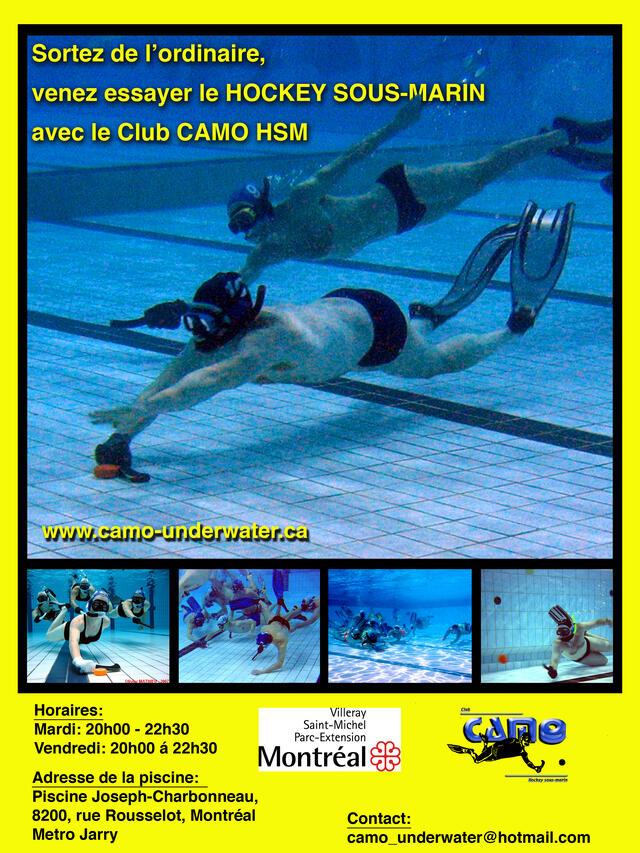
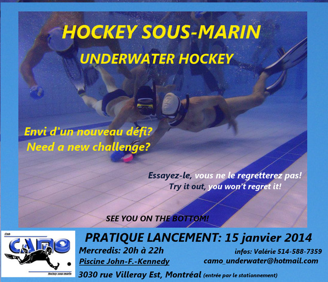
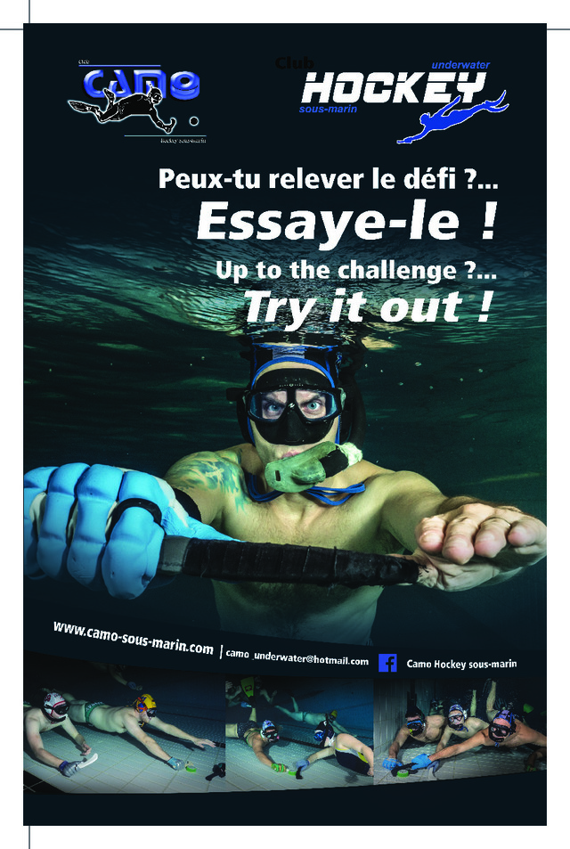
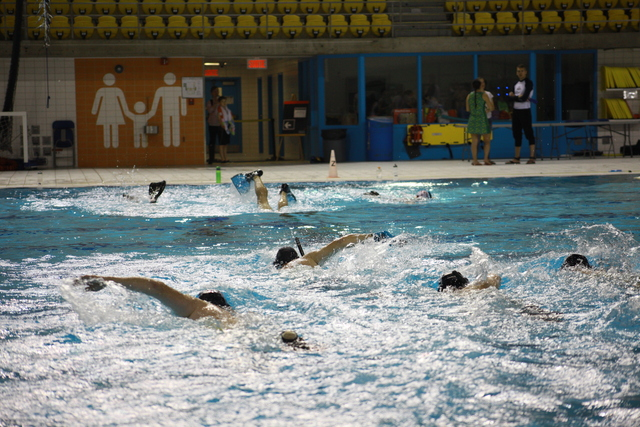
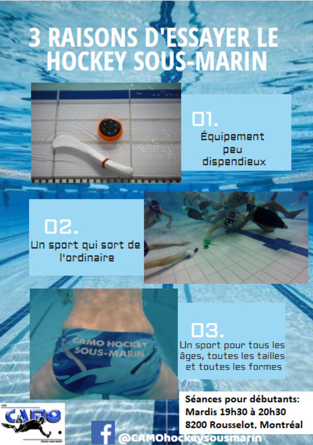

# Histoire de CAMO hockey subaquatique

Par Michel Langlois  

Sources :  

* Normand Lavallée  
* François Rouisse  
* Lionel Dumaux

## L’émergence du hockey subaquatique (1954)

On ne peut aborder l’histoire du club CAMO hockey sous-marin sans retracer les moments forts de l’émergence de la discipline. Inventé en 1954 dans le sud de l’Angleterre par Alan Blake, le hockey subaquatique est associé à l’image des huit tentacules de la pieuvre représentant une équipe composée de six joueurs et de deux remplaçants. Le jeu, très rudimentaire, consistait simplement à pousser une rondelle de laiton à l’aide d’une petite fourche en bois. Ainsi, l’*Octopush* faisait son entrée dans l’histoire du sport.

## Expansion initiale (Dès 1954)
L’intérêt pour la pratique du hockey doit beaucoup au caractère physique permettant aux amateurs de plongée et de chasse sous-marine de garder la forme. Dès 1954, l’enthousiasme pour la discipline se traduit rapidement par l’organisation de joutes entre clubs, de compétitions, de championnats, de parutions médiatiques, même de promotions à travers le tourisme. Le hockey connait alors une expansion dans le Commonwealth.

## Influence américaine et style Neil (1960s)
En 1960, six ans plus tard, sous l’influence de Bill Neil, la discipline se réinvente aux États-Unis dans la région de Chicago. Le style de Neil est fort différent du style anglais. Il se démarque par l’utilisation d’un mini bâton de hockey sur glace tenu à deux mains et, parfois, on porte même la bouteille de plongée. Mais le style anglais s’imposera aux États-Unis surtout dans les années 70 sous l’influence du Canada.

## Standardisation et Championnats du Monde (1980-1984)
On assiste alors à une période d’hésitation entre les deux styles. C’est la tenue successive de Championnats du monde (1980 \- Vancouver, 1982 \- Brisbane) qui progressivement convainc les adeptes de passer au bâton court. 1984 consacre définitivement cet usage avec la publication du règlement officiel de la C.M.A.S dans la foulée du Championnats du monde de Chicago.

## Arrivée au Canada (1962)
Au Canada, l’histoire du hockey subaquatique débute en 1962 à Vancouver avec l’instructeur de plongée australien Norm Liebeck. C’est d’ailleurs à partir de cette souche que le hockey migre progressivement vers l’est du pays.

## Implantation au Québec (1965 - Début Années 70)
Au Québec, le hockey s’implante en 1965 sous l’influence de Rodrigue Sarrazin et de Georges Bélanger. Au début des années 70, on recense du hockey subaquatique au collège de Maisonneuve de Montréal sous la forme d’une activité parascolaire avec Jean-Claude Rouisse.

## Croissance de la discipline au Québec (Années 70-80)
De là s’amorce une période de croissance de la discipline au Québec et ailleurs: naissance de clubs, officialisation de compétitions provinciales (1976, St-Hyacinthe), nationales (1975, Winnipeg) et internationales (1980, Vancouver).

## Les précurseurs de CAMO (Années 70)
Les précurseurs de CAMO sont les JoncNoir du collège de Maisonneuve, les Evil Shark de la piscine de Rosemont et quelques joueurs de la Montérégie.

## Naissance officielle de CAMO (1978)
Sous la direction de Jean Couture, le club de Rosemont adopte officiellement en 1978 le nom de CAMO dans la foulée des jeux Olympiques de Montréal. L’acronyme CAMO signifie d’ailleurs Club Aquatique Montréal Olympique qui prend racines en 1964 avec la natation et plus tard avec le water-polo.

## Succès nationaux et débuts internationaux (1982-1984)
Largement représenté par les membres du club CAMO, le championnat canadien de Winnipeg en 1982 marque le début du succès du Québec au pays, jusque-là dominé par l’Ouest canadien. À cette même époque, le club se tourne vers le défi des compétitions internationales. En octobre 1983, un groupe de joueurs de CAMO entreprennent un voyage en Angleterre. Ce séjour outre-mer leur donne l'occasion de se mesurer aux meilleures équipes européennes. Leur performance les encourage à participer au Championnat du monde de Chicago en 1984 où ils se classeront au 5e rang et au 4e rang chez les filles.

## Révolution technique québécoise (Années 80)
On note déjà à cette époque une progression du niveau technique des équipes. Ce développement est notamment dû à l'organisation de Championnats du monde depuis 1980, mais aussi à une génération de joueurs d'exception "produits" par CAMO. L’apport des Québécois est immense à l'éclosion du hockey subaquatique moderne.

## Prémices de la révolution technique (1984)
Les prémices de cette "révolution" dans le domaine de la technique individuelle étaient perceptibles dès 1984\. Avant chaque match, les joueurs exerçaient leur technique au bord du bassin.

## Champions du Monde et reconnaissance (1986)
Deux ans plus tard, ces mêmes joueurs étaient sacrés champions du monde aux dépens des Australiens. En 1986, les Québécois n’étaient pas reconnus pour leur tactique ni leur puissance physique, mais pour leur incroyable technique individuelle.

## Influence sur le développement international (1986-1990)
La victoire de 1986, et le séjour d’un an de Daniel Tétreault en Australie ont d'ailleurs convaincu les Australiens, tout comme les autres nations, de développer encore plus la technique individuelle. 1988 et 1990 seront aussi couronnées de succès en occupant successivement le 3e rang mondial.

## Génération d'athlètes d'exception (Fin Années 80)
Avec les frères Lebeau, les frères Pilon, et leurs fidèles amis, cette épopée internationale marque la période de toute une génération d’athlètes d’exception.

## Période de transition post-1990 (Début Années 90)
Après 1990, une partie de cette génération s’éloigne peu à peu du club, laissant place à une jeune relève qui peine à prendre sa place. C’est une période où le club se cherche une nouvelle identité, mais surtout un lieu fixe pour exercer sa passion.

## Consolidation à Joseph-Charbonneau (1992)
Son organisation quelque peu affaiblie se consolide en 1992 lorsque le club s’installe à la piscine Joseph-Charbonneau. Le club progresse par un confluent de joueurs issus de différents clubs, ce qui ne l’empêche pas de maintenir sa renommée et de continuer à faire bonne figure en compétition.

## Relève du Club Aquatique John F. Kennedy (1998-2000)
Il faut attendre près de 10 ans avant de voir arriver une nouvelle génération d’athlètes issus principalement du Club Aquatique John F. Kennedy. 1998 marque le retour des joueurs de CAMO au sein de l’équipe nationale du Canada, et 2000 permet à certains d’entre eux de goûter aux joies de podium en remportant la médaille de bronze et la médaille d’argent.

## Renouveau et développement durable (2010-2011)
Le club CAMO hockey sous-marin vit un renouveau dans les années 2010. Les dernières années ont vu arriver un nouveau groupe d'administrateurs qui poussent pour un développement durable. En 2011, le club accueille le rugby sous-marin dans son giron.
## Affiche 2009

## Organisation du tournoi de Montréal (Depuis 2012)
En 2012, succédant au feu Club Aquatique de JFK, CAMO prend sous sa gouverne l’organisation du tournoi de Montréal au Complexe sportif Claude-Robillard attirant annuellement, depuis la fin des années 90, une quinzaine d’équipes du Québec, de l’Ontario, de l’ouest du pays et des États-Unis.
## Affiche 2014

## Affiche 2015

## Le club CAMO aujourd'hui (Présent)
Au club, on y rencontre autant des joueurs de l’ancienne génération que des joueurs de l’élite canadienne qui ont marqué l’histoire du hockey au Québec, au Canada et dans le monde. Le club accueille avec fierté les joueurs de tous niveaux d’ici et d’ailleurs.
## Affiche Surface 2018

## Affiche 2023

## Entraînement et niveau de jeu (Présent)
Comme par le passé, recrues et anciens s’y entraînent pour améliorer leur niveau de jeu et gagner en expérience. Le niveau de jeu est intense, rapide et compétitif.

## Héritage et avenir (Présent)
Réputés pour leur goût de la compétition, les membres du club CAMO se transmettent la passion du hockey de génération en génération. Le club a une très longue tradition de gagnant. Comme en témoigne son histoire, CAMO a un brillant avenir et demeure l'un des clubs de hockey subaquatique les plus renommés en Amérique du Nord.

